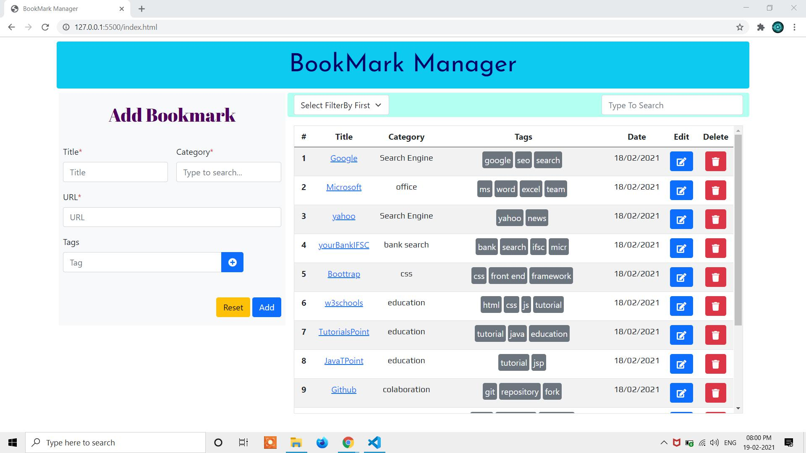
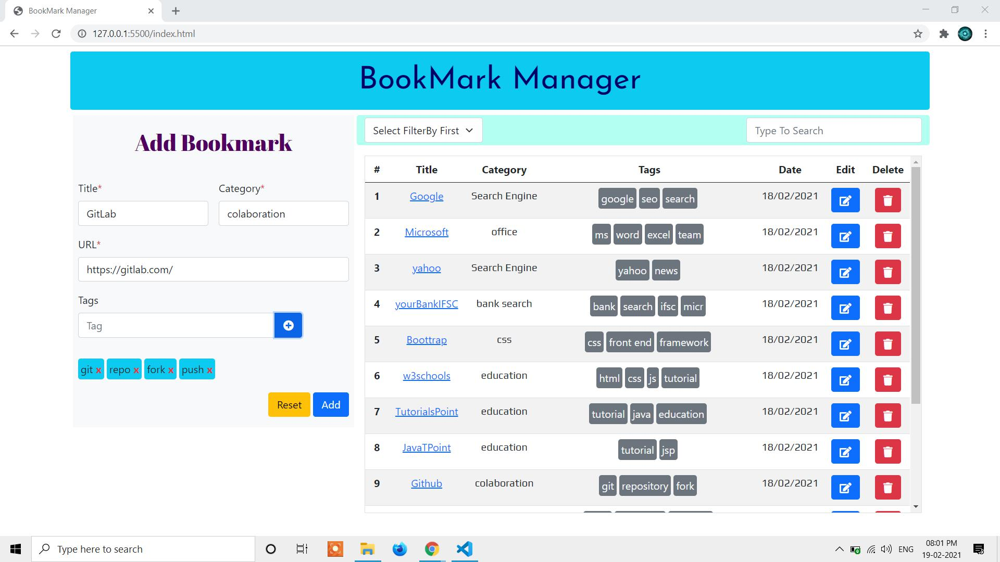
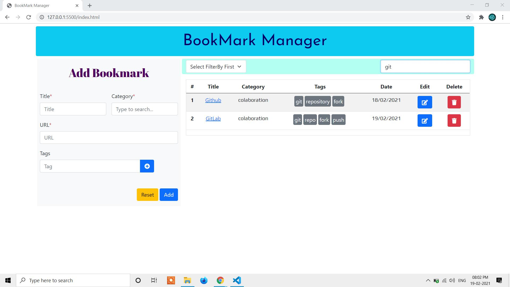
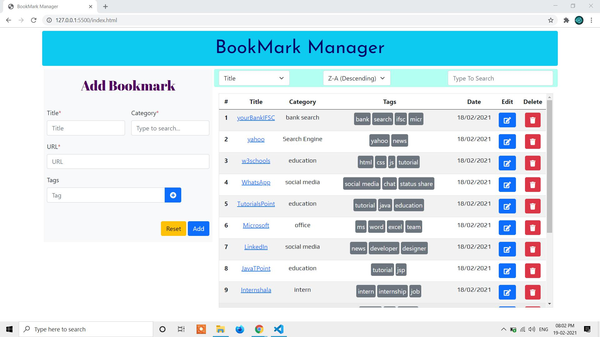
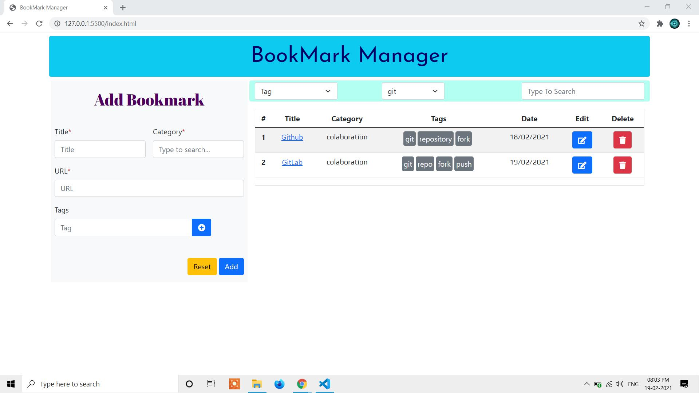
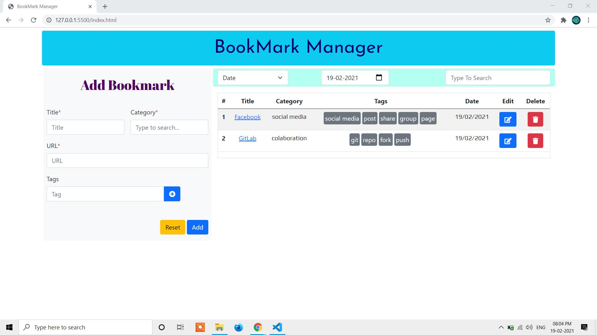
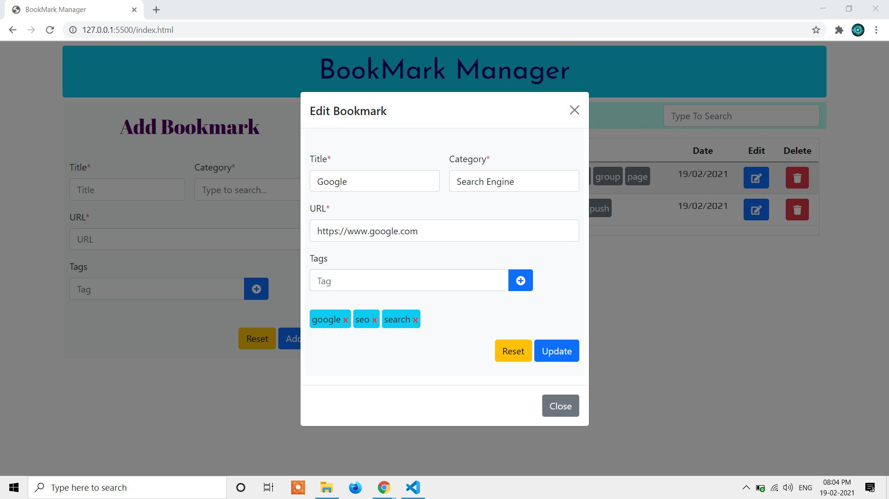

# This is a bookamrk manager web application developed using HTML, CSS, JS, Bootstrap5.
# Author: Dwaipayan Sardar ( dwaipayan.sardar@vitra.ai )
# These are some screenshots of the functionalities of this web application.
##  Main UI of BookMark Manager

-------------------------------------------------------------------------------------
##  Adding Bookmark in BookMark Manager

-------------------------------------------------------------------------------------
## Searching Bookmark in BookMark Manager

-------------------------------------------------------------------------------------
## Filtering Bookmark by Title in Decending Order in BookMark Manager

-------------------------------------------------------------------------------------
## Filtering Bookmark by Category as Colaboration in BookMark Manager

-------------------------------------------------------------------------------------
## Filtering Bookmark by Tag as git in BookMark Manager

-------------------------------------------------------------------------------------
## Filtering Bookmark by Date in BookMark Manager

-------------------------------------------------------------------------------------
## Edit Bookmark in BookMark Manager

-------------------------------------------------------------------------------------